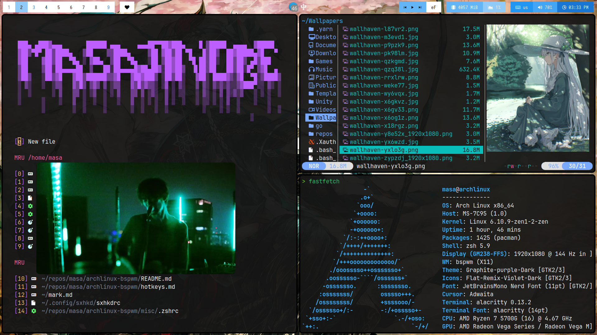

# Arch Linux bspwm сonfiguration

<p align="center">
  
</p>

## Description

This is my **personal** _Arch Linux BSPWM_ configuration. Please ensure that the packages I use suit your needs before installation. You can find the [Hotkeys](config/sxhkd/sxhkdrc) here.

|       OS       |               [Arch Linux](https://archlinux.org/)               |
| :------------: | :--------------------------------------------------------------: |
|   AUR Helper   |           [Paru](https://github.com/Morganamilo/paru)            |
|     Shell      |                     [Zsh](https://ohmyz.sh)                      |
| Window Manager |          [bspwm](https://github.com/baskerville/bspwm)           |
|      Bar       |          [Polybar](https://github.com/polybar/polybar)           |
|   Compositor   |             [Picom](https://github.com/yshui/picom)              |
|      Menu      |            [Rofi](https://github.com/davatorium/rofi)            |
|    Terminal    |       [Alacritty](https://github.com/alacritty/alacritty)        |
|  File Manager  |             [Yazi/Thunar](https://yazi-rs.github.io)             |
|    Browser     | [Chromium](https://archlinux.org/packages/extra/x86_64/chromium) |
|  Text Editor   |                   [Neovim](https://neovim.io)                    |

### Installation

#### AUR Helper

The initial installation of [Paru](https://github.com/Morganamilo/paru).

```sh
$ sudo pacman -Syu --needed neovim reflector git base-devel
$ git clone https://aur.archlinux.org/paru-git.git
$ cd paru && makepkg -si
$ cd ~ && rm -rf paru
```

#### Makepkg

To speed up the compilation of packages, edit the `makepkg.conf` file (use _nproc_ for see amount of CPU cores):

```sh
$ sudo nvim /etc/makepkg.conf

MAKEFLAGS="-j8"
```

#### Pacman

Enable parallel downloading of packages by editing the `pacman.conf` file:

```sh
$ sudo nvim /etc/pacman.conf

ParallelDownloads = 8
Color
```

#### Clone repository

Clone the repository and update submodules:

```sh
$ git clone --depth=1 --recurse-submodules https://github.com/masajinobe-ef/archlinux-bspwm
$ cd archlinux-bspwm && git submodule update --remote --merge
```

---

#### Installing packages

> Assuming your **AUR Helper** is [Paru](https://github.com/Morganamilo/paru), run:

```sh
$ paru -S --needed --noconfirm xorg-server xorg-xinit xorg-xrandr xorg-xsetroot xorg-xset bspwm sxhkd polybar python-pywal rofi-greenclip rofi chromium alacritty zsh dunst libnotify picom feh vulkan-radeon lib32-vulkan-radeon vulkan-icd-loader lib32-vulkan-icd-loader mesa mesa-utils mesa-vdpau libva-mesa-driver lib32-mesa networkmanager nm-connection-editor sof-firmware bluez bluez-utils acpid cronie udisks2 xdg-user-dirs yazi perl-image-exiftool ueberzugpp imagemagick xreader thunar tumbler ffmpegthumbnailer polkit-gnome lxappearance-gtk3 neovim mpv mpd mpdris2 ncmpcpp mpc tmux git lazygit stow yt-dlp ffmpeg fastfetch btop eza fzf fd ripgrep bat bat-extras rsync curl wget maim xdotool xclip zoxide aria2 hyperfine xsel reflector jq man-db poppler go rust nodejs npm yarn p7zip unrar zip unzip ttf-jetbrains-mono-nerd noto-fonts noto-fonts-emoji noto-fonts-cjk ttf-cascadia-code-nerd papirus-icon-theme
```

#### Copy configuration files

Copy the configuration files to the appropriate directories:

```sh
$ sudo chmod +x symlinks.sh
$ ./symlinks.sh
```

#### Daemons

Enable and start necessary services:

```sh
$ sudo systemctl enable acpid.service --now
$ sudo systemctl enable NetworkManager.service --now
$ sudo systemctl enable bluetooth.service --now
$ sudo systemctl enable sshd.service --now
$ sudo systemctl enable cronie.service --now
$ systemctl --user enable mpd.service --now
$ sudo systemctl enable reflector.timer
$ sudo systemctl enable fstrim.timer
```

---

#### Setting-up

Add languages to your system:

```sh
$ sudo nvim /etc/locale.gen

ru_RU.UTF-8 UTF-8

$ sudo locale-gen
```

Set the keyboard layout in X11:

```sh
$ sudo localectl --no-convert set-x11-keymap us,ru pc105+inet qwerty grp:caps_toggle
```

Configure the mouse settings:

```sh
$ sudo nvim /etc/X11/xorg.conf.d/30-pointer.conf

Section "InputClass"
    Identifier "pointer"
    Driver "libinput"
    MatchIsPointer "on"
    Option "NaturalScrolling" "false"
    Option "AccelProfile" "flat"
    Option "TransformationMatrix" "1 0 0 0 1 0 0 0 1.6"
EndSection
```

Configure reflector (pacman mirrors):

```sh
$ sudo nvim /etc/xdg/reflector/reflector.conf

--save /etc/pacman.d/mirrorlist
--protocol https
--country France,Germany,Finland,Russia,Netherlands
--latest 10
--sort rate
--age 12
```

Install Oh My Zsh:

```sh
$ sh -c "$(curl -fsSL https://raw.githubusercontent.com/ohmyzsh/ohmyzsh/master/tools/install.sh)
```

Consider installing the following plugins for Zsh:

- [powerlevel10k](https://github.com/romkatv/powerlevel10k?tab=readme-ov-file#oh-my-zsh)
- [zsh-autopair](https://github.com/hlissner/zsh-autopair?tab=readme-ov-file#oh-my-zsh)
- [zsh-autosuggestions](https://github.com/zsh-users/zsh-autosuggestions/blob/master/INSTALL.md#oh-my-zsh)
- [zsh-history-substring-search](https://github.com/zsh-users/zsh-history-substring-search?tab=readme-ov-file#install)
- [zsh-syntax-highlighting](https://github.com/zsh-users/zsh-syntax-highlighting/blob/master/INSTALL.md#oh-my-zsh)

Config tasks

To randomize wallpapers by time using feh, add the following line to your crontab:

```sh
*/5 * * * * DISPLAY=:0 feh --recursive --bg-fill --no-fehbg --randomize ~/Wallpapers/* &
```

## License

This project is licensed under MIT. Please refer to the [LICENSE](LICENSE) file for detailed license information.
