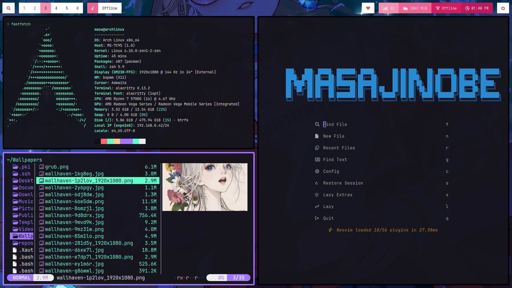

# BSPWM

<p align="center">
  
</p>

## Description

This is my **PERSONAL** _Arch Linux BSPWM_ config
Do not install packages that you do not need, make sure that what I use suits you.

|       OS       |               [Arch Linux](https://archlinux.org/)               |
| :------------: | :--------------------------------------------------------------: |
|   AUR Helper   |           [Paru](https://github.com/Morganamilo/paru)            |
|     Shell      |                     [Zsh](https://ohmyz.sh)                      |
| Window Manager |          [BSPWM](https://github.com/baskerville/bspwm)           |
|      Bar       |          [Polybar](https://github.com/polybar/polybar)           |
|   Compositor   |             [Picom](https://github.com/yshui/picom)              |
|      Menu      |            [Rofi](https://github.com/davatorium/rofi)            |
|    Terminal    |       [Alacritty](https://github.com/alacritty/alacritty)        |
|  File Manager  |                [Yazi](https://yazi-rs.github.io)                 |
|    Browser     | [Chromium](https://archlinux.org/packages/extra/x86_64/chromium) |
|  Text Editor   |                   [Neovim](https://neovim.io)                    |

### Installation

#### AUR Helper

The initial installation of [Paru](https://github.com/Morganamilo/paru).

```sh
$ sudo pacman -Syu --needed neovim git base-devel
$ git clone https://aur.archlinux.org/paru.git
$ cd paru && makepkg -si
$ cd ~ && rm -rf paru
```

#### Makepkg

Speed up compiling of packages (use _nproc_ for see amount of CPU cores)

```sh
$ sudo nvim /etc/makepkg.conf

MAKEFLAGS="-j16"
```

#### Pacman

Parallel downloading of packages

```sh
$ sudo nvim /etc/pacman.conf

ParallelDownloads = 8
Color
```

#### Clone repository

Clone repo and updating submodules

```sh
$ git clone --depth 1 --recurse-submodules https://github.com/masajinobe-ef/archlinux-bspwm
$ cd archlinux-bspwm && git submodule update --remote --merge
```

---

#### Installing packages

> Assuming your **AUR Helper** is [Paru](https://github.com/Morganamilo/paru).

```sh
$ paru -S --needed \

# X11
xorg-server \
xorg-xinit xorg-xrandr xorg-xsetroot \

# System
bspwm sxhkd \
polybar python-pywal \
rofi-greenclip rofi \
alacritty zsh \
dunst libnotify \
picom \
feh \

# Drivers and etc. (AMD)
mesa mesa-utils mesa-vdpau libva-mesa-driver \
sof-firmware \
bluez bluez-utils \
acpid cronie \
networkmanager nm-connection-editor \

# File manager
xdg-user-dirs yazi thunar tumbler lxappearance-gtk3 \
ffmpegthumbnailer perl-image-exiftool ueberzugpp \
polkit-gnome \

# Editor
neovim \

# Media
mpv mpd mpc mpdris2 ncmpcpp \

# CLI
yt-dlp ffmpeg \
fastfetch btop eza \
fzf fd ripgrep \
bat bat-extras \
maim xdotool xclip \
zoxide aria2 calc \
xsel reflector jq man-db poppler \

# Dev
go rust nodejs npm yarn \

# Archiver
p7zip zip unrar unzip unarchiver \

# Fonts & Icons
ttf-jetbrains-mono-nerd noto-fonts \
noto-fonts-emoji noto-fonts-cjk flat-remix \

# Software
telegram-desktop qbittorrent chromium \
obs-studio discord obsidian
```

#### Copy configuration files

```sh
# ~/.config
$ mkdir -p ~/.config && cp -r ~/archlinux-bspwm/config/* ~/.config

# ~/.local/bin
$ mkdir -p ~/.local/bin && cp -r ~/archlinux-bspwm/bin/* ~/.local/bin

# Make executable
$ sudo chmod +x ~/.config/bspwm/bspwmrc
$ sudo chmod +x ~/.config/polybar/launch.sh
$ sudo chmod +x ~/.local/bin/rofi-power-menu

# Misc
$ cp -r ~/archlinux-bspwm/misc/* ~
```

#### Daemons

```sh
$ sudo systemctl enable acpid.service --now
$ sudo systemctl enable NetworkManager.service --now
$ sudo systemctl enable fstrim.timer --now # For SSD
$ sudo systemctl enable bluetooth.service --now
$ sudo systemctl enable sshd.service --now
$ sudo systemctl enable reflector.timer
$ sudo systemctl enable cronie.service --now
$ systemctl enable mpd --now --user
```

---

#### Setting-up

Adding languages

```sh
$ sudo nvim /etc/locale.gen

ru_RU.UTF-8 UTF-8

$ sudo locale-gen
```

Keyboard layout in X11

```sh
$ sudo localectl --no-convert set-x11-keymap us,ru pc105+inet qwerty grp:caps_toggle
```

Config mouse

```sh
$ sudo nvim /etc/X11/xorg.conf.d/30-pointer.conf

Section "InputClass"
    Identifier "pointer"
    Driver "libinput"
    MatchIsPointer "on"
    Option "NaturalScrolling" "false"
    Option "AccelProfile" "flat"
    Option "TransformationMatrix" "1 0 0 0 1 0 0 0 1.6"
EndSection
```

Config tty

```sh
$ sudo nvim /etc/vconsole.conf

XKBLAYOUT=us,ru
XKBMODEL=pc105+inet
XKBOPTIONS=grp:caps_toggle
XKBVARIANT=qwerty
KEYMAP=us
FONT=cyr-sun16
USECOLOR=yes
```

Config reflector

```sh
$ sudo nvim /etc/xdg/reflector/reflector.conf

--save /etc/pacman.d/mirrorlist
--protocol https
--country France,Germany,Finland,Russia,Netherlands,Latvia,Estonia,Norway
--latest 20
--sort rate
```

Install Oh My Zsh and Plugins

```sh
$ sh -c "$(curl -fsSL https://raw.githubusercontent.com/ohmyzsh/ohmyzsh/master/tools/install.sh)
$ git clone https://github.com/hlissner/zsh-autopair ${ZSH_CUSTOM:-~/.oh-my-zsh/custom}/plugins/zsh-autopair \
git clone https://github.com/zsh-users/zsh-autosuggestions ${ZSH_CUSTOM:-~/.oh-my-zsh/custom}/plugins/zsh-autosuggestions \
git clone https://github.com/zsh-users/zsh-history-substring-search ${ZSH_CUSTOM:-~/.oh-my-zsh/custom}/plugins/zsh-history-substring-search \
git clone https://github.com/zsh-users/zsh-syntax-highlighting.git ${ZSH_CUSTOM:-~/.oh-my-zsh/custom}/plugins/zsh-syntax-highlighting
```

Config tasks (cronie -e)

Randomizing wallpapers by time with feh

```sh
*/1 * * * * DISPLAY=:0 feh --recursive --bg-fill --no-fehbg --randomize ~/Wallpapers/* &
```
